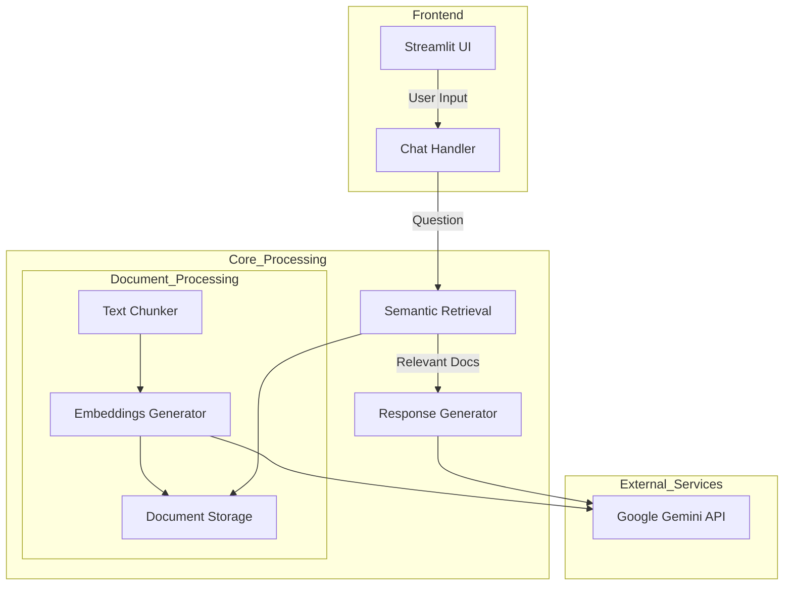

# 師大附中小助手
[展示網頁](https://hsnu-assistant.streamlit.app/)<br/>
基於 Gemini 2.0 flash 與 RAG 技術，提供附中學生易用的校園小幫手

## 專案架構


## 本機部署
必要環境：Python 3.9+
1. clone repo
  ```bash
  git clone https://github.com/Sen1011/HSNU-assistant.git
  ```
2. 安裝套件
  ```bash
  pip install requirements.txt
  ```
3. 進入專案目錄執行
  ```bash
  streamlit run app.py
  ```
